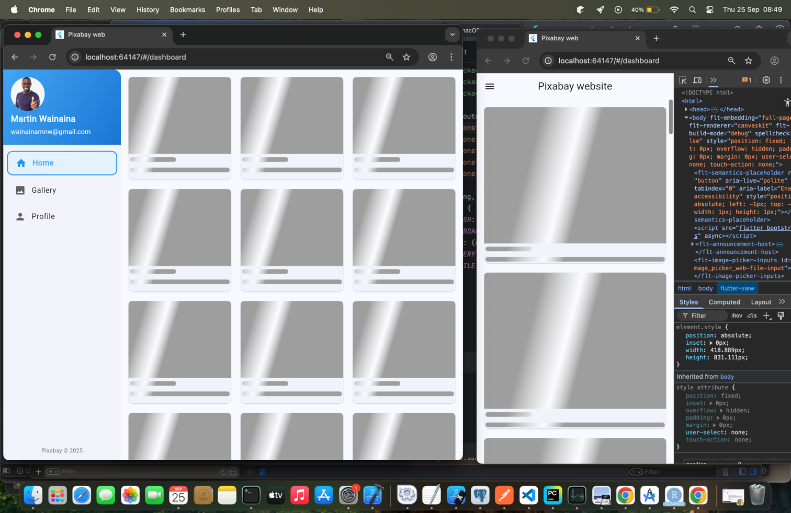
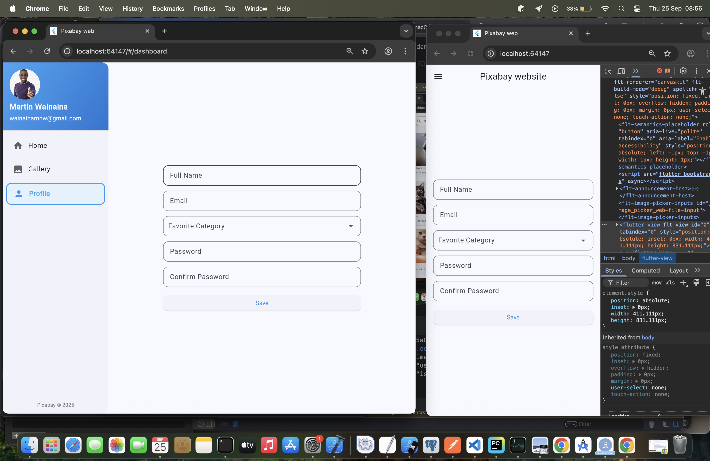

# pixabay

Pixabay Project project.

## Getting Started

- Run using below command to avoid CORs
```
flutter run -d chrome --web-browser-flag "--disable-web-security" --web-browser-flag "--user-data-dir=/tmp/flutter_web_chrome"
```

## Screenshots

<!--| Light Mode  |-->
<!--|-----------------------------|-->
<!--|                 |-->
<!--|                 |-->
<!--|                 |-->
<!--|                 |-->

## Tech Stacks used:
1. Flutter framework + Dart language
2. S.O.L.I.D principles adhered to
3. Clean architecture using MVC